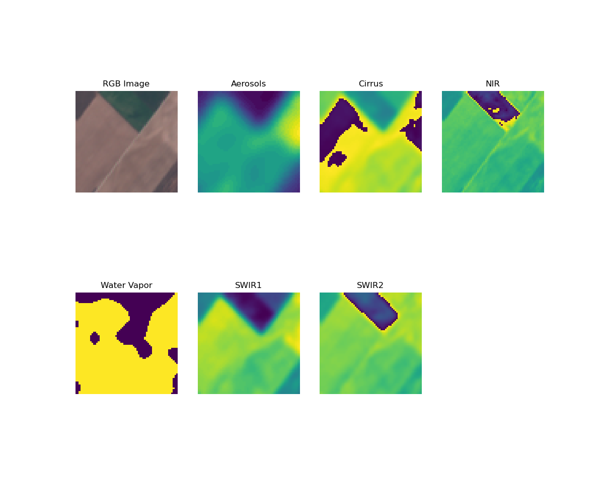

# StarterPack to GIS
## Useful Links
- [autoGIS](https://automating-gis-processes.github.io/2016/Lesson7-read-raster-array.html)
- [pyGIS](https://automating-gis-processes.github.io/CSC18/lessons/L6/overview.html)
- [EuroSAT data](https://github.com/phelber/EuroSAT)
- [geoearth](https://www.geoearth.ai/)

## EuroSAT: Sentinel-2’s Multispectral Imager (MSI)
